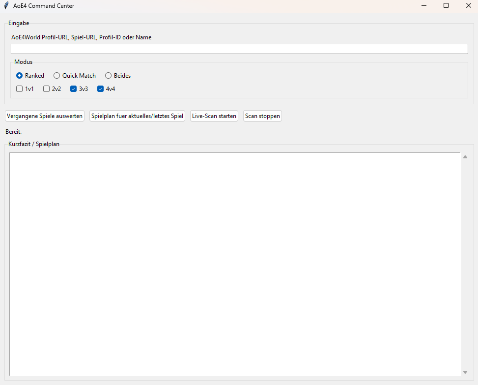
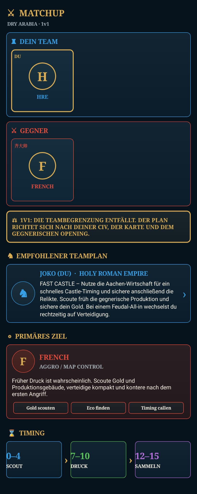
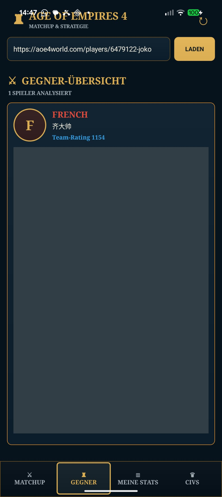
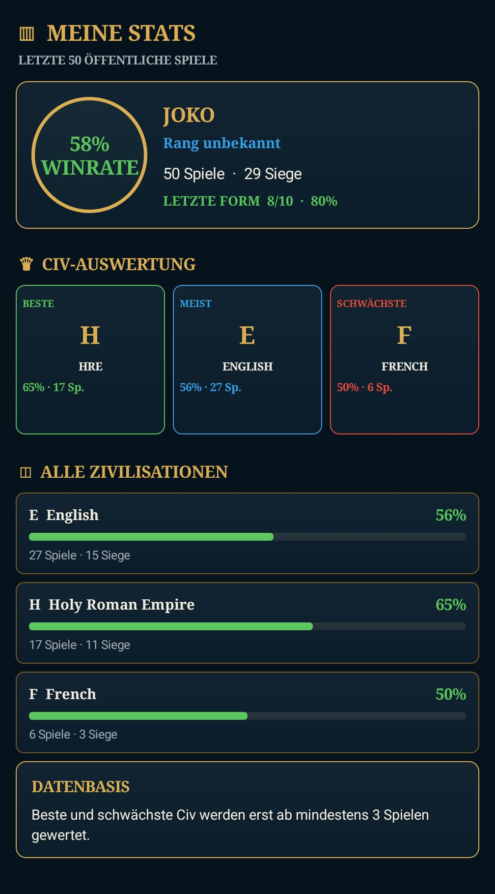
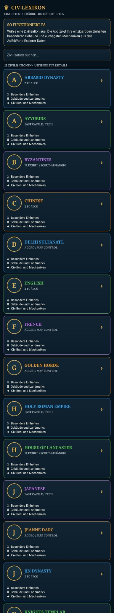

# AoE4 Command Center



Dieses kleine Tool wertet Age of Empires IV Spiele aus und erzeugt Spielplaene fuer laufende oder kommende Matches. Es nutzt die oeffentliche AoE4World-API und unterstuetzt 1v1, 2v2, 3v3 und 4v4.

## Android-App

Die neue Android-App liegt im Ordner [`android-app`](android-app). Sie bietet einen Matchup- und Strategieplan, Gegneranalysen, eigene Statistiken sowie ein Civ-Lexikon mit Daten von AoE4World.

| Matchup | Gegner | Meine Stats | Civ-Lexikon |
|---|---|---|---|
|  |  |  |  |

Die Android-App kann als eigenes Projekt in Android Studio geöffnet werden. Eine ausführliche Anleitung steht in der [Android-README](android-app/README.md).

## Nutzung Mit Oberflaeche

Am einfachsten:

1. `start_programm_ohne_cmd.vbs` doppelklicken
2. AoE4World-Profil-URL, Spiel-URL, Profil-ID oder Spielernamen eingeben
3. Modus waehlen: Ranked, Quick Match oder beides
4. Spielgroesse waehlen: 1v1, 2v2, 3v3, 4v4
5. Button druecken:
   - `Vergangene Spiele auswerten`
   - `Spielplan fuer aktuelles/letztes Spiel`
   - `Live-Scan starten`

Der Kurzbericht oder Spielplan wird direkt im Fenster angezeigt. Dateien landen zusaetzlich im Ordner `reports`.
Im Tab `Verlauf` findest du die letzten gespeicherten Auswertungen und Spielplaene wieder.

Es werden zwei Dateien erzeugt:

- `*_kurzbericht.md`: kurze Auswertung des letzten Spiels mit Tipps
- `*_details.md`: genaue Tabellen, Team-Konstellationen und Vergleichsdaten
- `verlauf.json`: Verlauf der zuletzt erzeugten Auswertungen fuer die Oberflaeche

Beim Early-Game-Spielplan wird eine Datei erzeugt:

- `*_spielplan.md`: Map-Plan, Rollen, erstes Ziel und Timing fuer das laufende oder angegebene Spiel

## Nutzung per Konsole

```powershell
python .\aoe4_team_analyzer.py "DEIN_SPIELERNAME"
```

Oder mit AoE4World-Profil-ID:

```powershell
python .\aoe4_team_analyzer.py 1234567
```

Oder mit einem konkreten AoE4World-Spiel:

```powershell
python .\aoe4_team_analyzer.py "https://aoe4world.com/players/1234567-spielername/games/123456789"
```

Early-Game-Spielplan per Konsole:

```powershell
python .\aoe4_team_analyzer.py "DEIN_SPIELERNAME" --modes rm_3v3,rm_4v4 --plan
```

Die Berichte landen danach im Ordner `reports`.

## Nur Ranked Team 3v3/4v4

```powershell
python .\aoe4_team_analyzer.py "DEIN_SPIELERNAME" --modes rm_3v3,rm_4v4
```

## Mehr oder weniger Spiele auswerten

```powershell
python .\aoe4_team_analyzer.py "DEIN_SPIELERNAME" --limit 100
```

`--limit` gilt pro Modus. Bei der Standardauswertung werden `rm_3v3`, `rm_4v4`, `qm_3v3` und `qm_4v4` betrachtet.

## Was ausgewertet wird

- Kurzbericht: letztes Spiel, Kurzreview, Vergleich zu vorher, naechster Fokus
- Detailbericht: Winrate nach Modus, Map, eigener Civilization und Matchlaenge
- haeufige Mitspieler und gemeinsame Ergebnisse
- wiederkehrende Team-Konstellationen, also Spiele mit genau den gleichen Mitspielern
- das letzte Team: wer im letzten Spiel dabei war und wie fruehere Spiele mit dieser Gruppe liefen
- das letzte Spiel als eigener Review-Block mit Gut/Schlecht-Punkten pro Teammitglied
- kompaktes Kurzreview nach dem Muster: wichtigster Punkt, verpasste Chance, Rollencheck, Mapcheck
- persoenlicher Fokus fuer den anfragenden Spieler: Rolle, Map-Plan, Build-Order-Check und naechster Trainingspunkt
- Vergleich des letzten Spiels mit den vorherigen 10 Spielen mit den gleichen Teamkameraden
- Teamtrend: was gegenueber den vorherigen Spielen besser oder schlechter wurde
- kurzes Gut/Schlecht-Fazit pro haeufigem Mitspieler
- gegnerische Civilizations, die in Niederlagen oft vorkommen
- Rating-/MMR-Entwicklung innerhalb der betrachteten Spiele
- konkrete Verbesserungsvorschlaege aus den sichtbaren Mustern

Wenn du oft mit den gleichen Leuten spielst, nutze am besten mehr Spiele:

```powershell
python .\aoe4_team_analyzer.py "DEIN_SPIELERNAME" --modes rm_3v3,rm_4v4 --limit 100
```

Dann erkennt der Bericht besser, welche feste Gruppe auf welchen Maps oder in welcher Matchlaenge gut funktioniert.

## Wichtig

AoE4World liefert fuer die Match-History keine vollstaendige Replay-Analyse wie Idle-TC, Build-Order-Fehler, Ressourcenfloats, Key-Timings aus dem Replay oder echte Build-Order-Daten. Der Kurzbericht nutzt deshalb feste Build-Order-Checkpunkte aus den Team-Guides und kombiniert sie mit Matchdaten wie Civ, Map, Gegner, Dauer und Ergebnis. Fuer eine tiefere Analyse gibt es im Detailbericht einen Bereich fuer Replay-Notizen.

Quelle der Daten: [AoE4World API](https://aoe4world.com/api).
